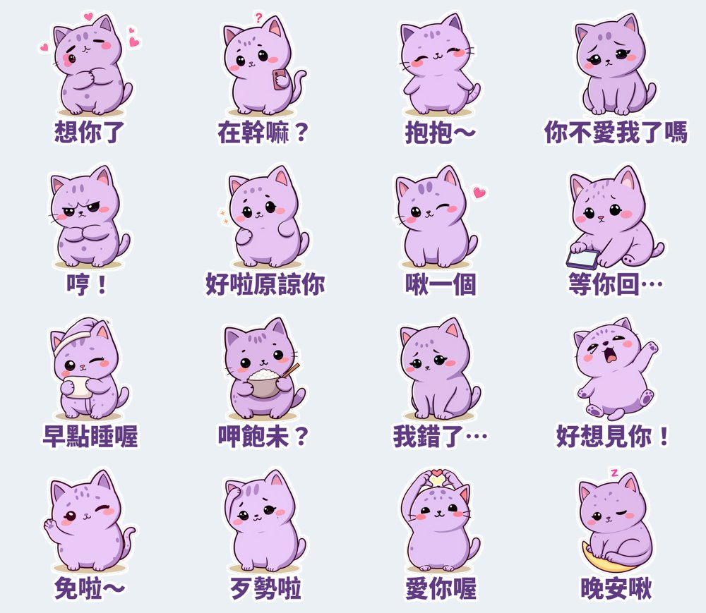
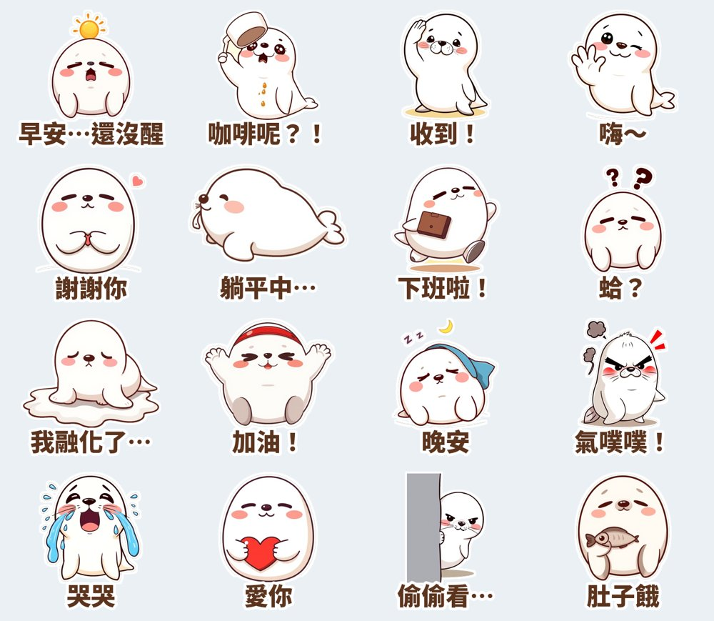

每天打開 LINE，你用最多的大概不是文字，而是貼圖。LINE 台灣公布的 2025 年度排行裡，原創貼圖第一名是「戀愛兔」，接著是「吉伊卡哇」和「開心熊貓」，黑馬則有「醜嫩狗勾」和「那隻水母」。光是「表情回應」功能，每個月就有約 940 萬活躍使用者在用。

我把這些排行和近期的免費貼圖、創作者分享看過一輪，整理出爆款貼圖反覆出現的 5 個共同點。然後實際照著這份清單，做了一組新貼圖來驗證。

## 爆款貼圖的 5 個共同點

### 1. 一個「一眼記得住」的原創角色
排行前段幾乎都是原創角色，不是單純的字卡。角色造型越簡單越好：圓滾滾的身體、大頭、大眼、腮紅。縮成手機上的小圖也認得出來，才會被一用再用。

### 2. 貼近「關係」的情境
戀愛兔能拿第一，是因為台詞直接戳中情侶日常：「你外遇」、「你不愛我了」。情侶、夫妻、家人、媽媽跟小孩的對話，是最常傳貼圖的場合。**貼圖是拿來「替你說出不好意思說的話」的。**

### 3. 在地語感（台語、口頭禪）
「免啦」、「歹勢啦」、「呷飽未」這類台語或口頭禪，比標準國語更有溫度，也更難被翻譯成別國貼圖取代，是台灣創作者的天然護城河。

### 4. 一套就能聊完一整天
早安、吃飯沒、在幹嘛、想你、生氣、道歉、原諒、晚安……好用的貼圖組會把一天裡最常出現的情緒都放進去。使用者不想為了一句話切換好幾組貼圖。

### 5. 系列化、持續出新
熱門角色幾乎都是「同一個角色出很多集」。第一組建立辨識度，之後每出一組，舊的粉絲就是現成買家。

## 實驗：新角色「芋圓貓」

照上面 5 點，我做了一組 16 張的情侶日常貼圖：

- **角色**：芋頭冰淇淋色的胖胖貓「芋圓貓」，黏人、愛撒嬌（共同點 1）
- **情境**：想你、抱抱、你不愛我了嗎、哼、好啦原諒你、啾一個（共同點 2）
- **在地語感**：呷飽未？、免啦～、歹勢啦（共同點 3）
- **一套聊一天**：從「在幹嘛？」到「晚安啾」（共同點 4）

上一組是「麻糬海豹噗嚕」，走上班族厭世路線，用來測試職場情境：

兩組都是用本機的 AI 繪圖模型生圖，再用程式去背、加白邊和文字。LINE 允許 AI 輔助的貼圖，但會在商店頁標示，送審時也要照實勾選。

## 什麼時候買得到？

**更新（10/10）：兩組貼圖都已經送 LINE Creators Market 審核，目前是「等待審核」。** 審核通常要幾天到一週，通過後會自動開賣，售價 NT$42（LINE 在台灣的最低價位）。開賣後我會把商店連結補在這篇文章裡。想第一時間知道，可以收藏我的 [LINE 貼圖作者頁](https://line.me/S/shop/sticker/author/6564520)，或到 LINE STORE 搜尋「芋圓貓」或「麻糬海豹噗嚕」。

芋圓貓也報名了 LINE 官方的「我們的戀愛日常貼圖特輯」，如果審核通過，12 月中會出現在貼圖小舖的特輯橫幅裡。

## 給也想做貼圖的你：收入的真相

先講現實：一組 NT$30 的貼圖，扣掉 App Store／Google Play 的 30% 和 LINE 的分成，創作者每賣一組大約只拿到 NT$10 左右。有台灣創作者分享，14 個月賣了約 4,000 組，入帳約 NT$28,000。

所以貼圖比較像「累積型」的小收入：靠角色辨識度和系列化慢慢長大，不是一夜爆紅的生意。不過做的過程本身很好玩。我接下來會固定每週一、三、五做一組新的，把哪些情境賣得動、哪些賣不動，持續記錄在這裡。

---

*你最常傳的一張貼圖是哪一句？哪種情境你覺得「明明很常用卻一直找不到好貼圖」？歡迎到 X（[@KWC59125740](https://x.com/KWC59125740)）告訴我，下一組就做那個。*
